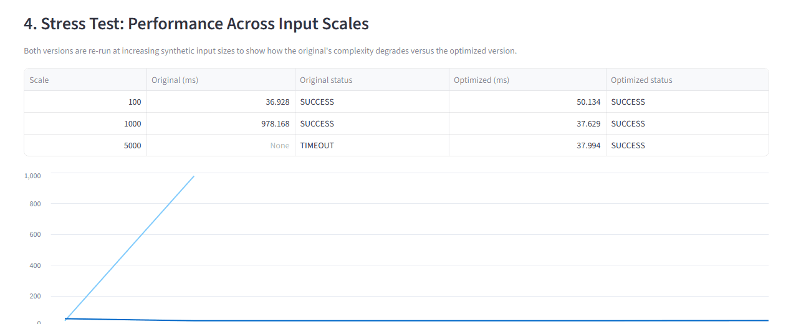

# ⚡ Opti-Stack: Autonomous Algorithmic Auditor
[](https://github.com/anishgoyal0603/Opti-Stack/actions/workflows/ci.yml)
[](LICENSE)
[](https://www.python.org/downloads/)

A multi-agent system that rewrites slow Python — then **proves the rewrite is
correct before accepting it.**



[Design notes](docs/design.md)

<!-- Once deployed (see Deployment section), add a live demo link here, e.g.:
**[Live demo](https://opti-stack.streamlit.app)** · [Design notes](docs/design.md)
Do not add this link until the app is actually deployed -- a dead link is worse than no link. -->

A multi-agent system that acts as an automated Senior Staff Engineer:
feed it a slow or naive Python script, and it diagnoses the algorithmic
bottleneck, rewrites the code, **verifies the rewrite is behaviorally
identical to the original**, and benchmarks both versions across multiple
synthetic input scales.

## The problem this solves

Engineers regularly write or inherit correct-but-slow code under time
pressure — nested loops that should be hash lookups, O(N²) scans that
should be O(N log N). Manually profiling, diagnosing, and safely
rewriting that code takes real senior-engineer judgment. Opti-Stack
automates the full loop, with a critical safety property most "AI code
optimizer" demos skip: **it refuses to accept a faster rewrite unless it
proves the rewrite produces identical output to the original.**

## Architecture

```
  user script
      │
      ▼
┌───────────────────────────┐
│ Security Scanner          │   rejects unsafe input before any agent runs
└───────────────────────────┘
              │
              ▼
┌───────────────────────────┐
│ Analyst  (LLM)            │   diagnoses the algorithmic bottleneck
└───────────────────────────┘
              │
              ▼
┌───────────────────────────┐
│ Normalizer  (LLM)         │   extracts a SCALE variable for fair scale-sweeps
└───────────────────────────┘
              │
              ▼
┌───────────────────────────┐
│ Benchmarker skill         │   profiles the ORIGINAL script (sandboxed subprocess)
└───────────────────────────┘
              │
              ▼
┌───────────────────────────┐
│ Optimizer  (LLM)          │   rewrites the code -- up to 3 attempts, see note below
└───────────────────────────┘
              │
              ▼
┌───────────────────────────┐
│ Security Scanner          │   on the generated code this time
└───────────────────────────┘
              │
              ▼
┌───────────────────────────┐
│ Benchmarker skill         │   profiles the OPTIMIZED script
└───────────────────────────┘
              │
              ▼
┌───────────────────────────┐
│ Verifier  (deterministic) │   checks stdout match against the original
└───────────────────────────┘
              │
              ▼
┌───────────────────────────┐
│ Stress-Tester             │   scale sweep across synthetic input sizes
└───────────────────────────┘
```

The diagram above shows the happy path top to bottom, but the
**Coordinator** (`opti_stack/orchestrator.py`) doesn't run a fixed script — it
branches: the four steps from Optimizer through Verifier form a bounded
retry loop (up to 3 attempts). If the Verifier rejects an optimization
attempt, the Coordinator routes the failure reason back to the Optimizer
agent for another try, rather than presenting an unverified rewrite as a
success; if all 3 attempts fail, the Coordinator gives up and surfaces
the failure honestly to the user. Note that the Security Scanner runs
twice per pipeline: once on the user's original input, and again on
every piece of code the Optimizer generates -- a prompt-injected input
could otherwise steer the Optimizer into producing unsafe code, so
scanning only the input isn't enough.

## Course concepts demonstrated

| Concept | Where |
|---|---|
| Multi-agent system | `opti_stack/orchestrator.py` — Analyst, Normalizer, Optimizer, Verifier as distinct roles coordinated by one orchestrator, with branching control flow based on agent output |
| Agent skills | `.agents/skills/code-benchmarker/` — a documented, sandboxed, timeout-bounded capability (`SKILL.md` + `runner.py`) callable by the agent system |
| Guardrails / security | `opti_stack/security_scanner.py` — AST-based static scan rejects dangerous imports/calls (os, subprocess, eval, etc.) before any code executes, applied to both user input and every LLM-generated rewrite |
| Correctness verification | The Verifier's deterministic stdout-diff gate (rejects fast-but-wrong rewrites instead of accepting them, with bounded retry) |
| Fault tolerance | `GeminiClient` model-fallback chain handles quota limits, 503s, and deprecated model IDs without crashing the pipeline |
| Observability | Every agent step (input, output, verification verdict) is captured in a structured trace, surfaced in the UI's "Full agent trace" panel |

## Project structure

```
opti-stack-project/
├── .github/workflows/
│   └── ci.yml                         # CI: pytest on 3.11/3.12, plus a no-SDK unit-test job
├── .agents/skills/code-benchmarker/   # the benchmarking skill
│   ├── SKILL.md
│   └── scripts/runner.py
├── opti_stack/                        # core package -- all business logic lives here
│   ├── orchestrator.py                # coordination/branching logic only
│   ├── llm_client.py                  # Gemini API wrapper + retry/model fallback
│   ├── prompts.py                     # all agent role prompts
│   ├── benchmarking.py                # subprocess benchmark runner + scale sweep
│   ├── verification.py                # deterministic correctness checker
│   ├── security_scanner.py            # AST-based static security gate
│   ├── synthetic_data.py              # SCALE-variable injection for stress tests
│   └── cli.py                         # CLI entry point
├── ui/
│   └── app.py                         # Streamlit front-end
├── docs/
│   ├── demo.gif                       # scale-sweep demo, shown at the top of this README
│   └── design.md                      # why the Verifier is deterministic, why the scanner runs twice, etc.
├── tests/                             # pytest suite
├── pyproject.toml                     # pytest + coverage config (70% floor)
├── requirements.txt
├── env.example                        # copy to .env and add your own Gemini API key
├── .gitignore
├── LICENSE
└── README.md                          # this file
```

Each module in `opti_stack/` has exactly one job: `orchestrator.py` only
decides *what order things happen in and how to branch* -- it doesn't
know how the LLM API works (`llm_client.py`), what to say to it
(`prompts.py`), how to measure performance (`benchmarking.py`), or how to
judge correctness (`verification.py`). This means, for example, swapping
Gemini for another model provider only touches `llm_client.py`.

## Setup (free / local)

```bash
python3 -m venv .venv
source .venv/bin/activate          # Windows: .venv\Scripts\activate
pip install -r requirements.txt

cp env.example .env                # then paste your free Gemini API key into .env
```

Get a free Gemini API key at [aistudio.google.com](https://aistudio.google.com) — the free tier is sufficient for demo purposes.

`.env` is loaded automatically via `python-dotenv` the moment the app
starts -- no need to manually export the variable into your shell.

## Run

```bash
# Web UI (run from the repo root)
python3 -m streamlit run ui/app.py

# CLI (also run from the repo root, as a module)
python -m opti_stack.cli --inline "print('hello world')"
python -m opti_stack.cli path/to/script.py
```

## Test

```bash
pytest tests/ -v
```

## Known limitations (stated honestly, not hidden)

- The Normalizer agent's SCALE-extraction is itself an LLM call and can
  occasionally fail on unusual code shapes; the scale-sweep chart should
  be read as a best-effort demo enhancement, not a guarantee.
- Verification compares stdout only. Scripts that don't print their
  result, or that have side effects beyond stdout (file writes, network
  calls), are not currently verified for those side effects.
- Sandbox isolation is process-level (subprocess + timeout + a per-run
  temporary directory, so concurrent runs cannot read or overwrite each
  other's generated code), not a full container/VM sandbox — sufficient
  for a hackathon demo, not for untrusted production multi-tenant use
  without further hardening.
- The security gate is a **denylist over an AST scan, not a sandbox**. It blocks
  process, filesystem, network and dynamic-import escapes by name, and is
  verified against a suite of known bypass payloads. It does not defeat a
  determined adversary — obfuscated bytecode tricks and unicode homoglyph
  attacks are out of scope. It is one layer; the subprocess timeout and the
  per-run temp directory are the others. Do not expose this to untrusted
  multi-tenant traffic without a container or gVisor boundary.